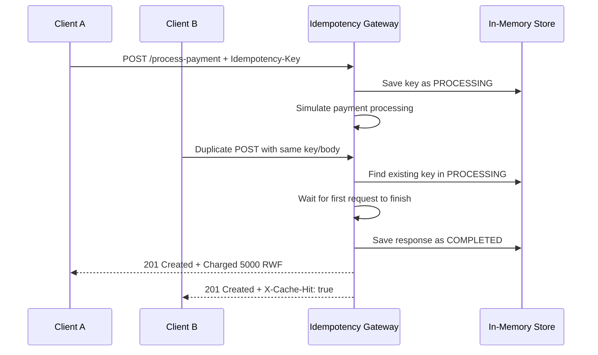

# Idempotency Gateway

`Idempotency Gateway` is a Spring Boot REST API that protects payment processing from duplicate requests. When clients send the same `Idempotency-Key` with the same request body, the payment is processed once and the saved result is replayed for later calls.

## Project Structure

- `controller`: exposes the REST endpoint
- `service`: contains the idempotency and concurrency logic
- `model`: defines request objects and stored request state

## Endpoint

- `POST /process-payment`
- Header: `Idempotency-Key: <unique-key>`
- Body:

```json
{
  "amount": 5000,
  "currency": "RWF"
}
```

## How It Works

1. If the key is new, the gateway stores the request as `PROCESSING`, waits 2 seconds to simulate a downstream payment call, then saves the response as `COMPLETED`.
2. If the same key arrives again with the same body, the gateway returns the saved response immediately and adds `X-Cache-Hit: true`.
3. If the same key arrives with a different body, the gateway returns `409 Conflict`.
4. If the first request is still running, concurrent duplicates wait for it to finish and then receive the same saved result instead of processing again.

## Sequence Diagram



## Example Requests

### 1. First request

```bash
curl -i -X POST http://localhost:8083/process-payment ^
  -H "Content-Type: application/json" ^
  -H "Idempotency-Key: payment-rwf-001" ^
  -d "{\"amount\":5000,\"currency\":\"RWF\"}"
```

Example response:

```http
HTTP/1.1 201 Created
Location: /process-payment/payment-rwf-001

Charged 5000 RWF
```

### 2. Same key and same body

```bash
curl -i -X POST http://localhost:8083/process-payment ^
  -H "Content-Type: application/json" ^
  -H "Idempotency-Key: payment-rwf-001" ^
  -d "{\"amount\":5000,\"currency\":\"RWF\"}"
```

Example response:

```http
HTTP/1.1 201 Created
X-Cache-Hit: true

Charged 5000 RWF
```

### 3. Same key and different body

```bash
curl -i -X POST http://localhost:8083/process-payment ^
  -H "Content-Type: application/json" ^
  -H "Idempotency-Key: payment-rwf-001" ^
  -d "{\"amount\":7000,\"currency\":\"RWF\"}"
```

Example response:

```http
HTTP/1.1 409 Conflict

Idempotency key already used for a different request body
```

## Design Decisions

- `ConcurrentHashMap<String, StoredRequest>` is used for a thread-safe in-memory idempotency store.
- Each `StoredRequest` keeps the original request body, current processing status, and the saved response.
- A `CountDownLatch` lets concurrent duplicate requests wait for the first in-flight request instead of reprocessing.
- The service replays the original `201 Created` status for the completed request, which keeps duplicate responses consistent.

## Extra Feature

Completed idempotency keys expire automatically after a configurable TTL. This prevents the in-memory store from growing forever in a long-running service.

Properties:

- `payment.processing.delay.ms` default: `2000`
- `idempotency.entry.ttl.ms` default: `600000`

## Running the Project

```bash
mvn spring-boot:run
```

The service is configured to run on `http://localhost:8083`.

## Render Deployment

This project includes a `Dockerfile` for Render deployment.

Recommended Render settings:

- Runtime: `Docker`
- Branch: `main`
- Root Directory: leave blank
- Build Command: leave blank when using Docker
- Start Command: leave blank when using Docker
- Instance Type: `Free`

The application reads Render's `PORT` environment variable automatically.

## Postman Testing

Use the following request in Postman:

- Method: `POST`
- URL: `http://localhost:8083/process-payment`
- Headers:
  - `Content-Type: application/json`
  - `Idempotency-Key: payment-rwf-001`
- Raw JSON body:

```json
{
  "amount": 5000,
  "currency": "RWF"
}
```

Repeat the same request to confirm the cached replay, then change the amount while keeping the same key to verify the conflict response.

## Running Tests

```bash
mvn test
```
